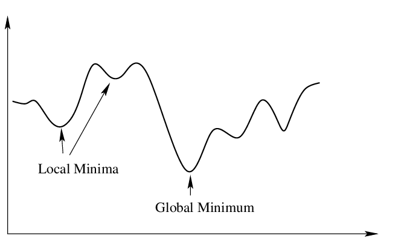
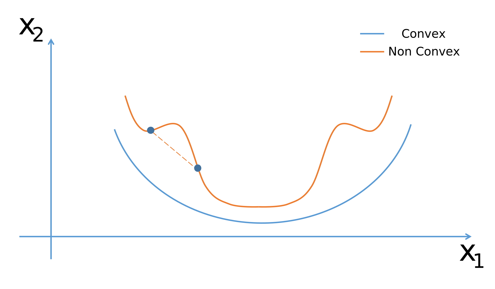
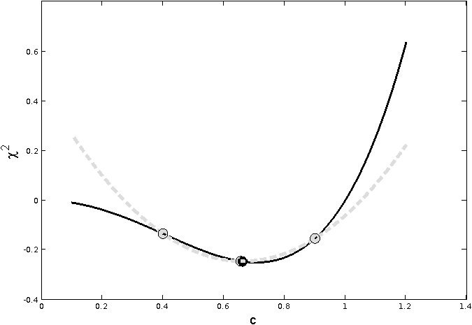

# Numerical Methods for Solving Optimization Problems

## Jason Lu

## Table of Contents
1. [Overview](#Overview)
    - [Brief History](#brief-history)
2. [Convexity in Optimization](#convexity-in-optimization)
3. [1-D Optimization for Nonlinear Optimization Problems](#1-d-optimization-for-nonlinear-optimization-problems)
    - [Successive Parabolic Interpolation](#successive-parabolic-interpolation)
    - [Newton's Method](#newtons-method)
4. [Unconstrained Optimization](unconstrained-optimization)
    - [Optimality Conditions in Unconstrained Optimization](#optimality-conditions-in-unconstrained-optimization)
        - [First Order](#first-order)
        - [Second Order](#second-order)
    - [Steepest Descent](#steepest-descent)
5. [Constrained Optimization](#constrained-optimization)
    - [Optimality Conditions in Constrained Optimization](#optimality-conditions-in-constrained-optimization)
        - [Karush-Kuhn-Tucker Conditions](#karush-kuhn-tucker-conditions)
    - [Linear Programming](#linear-programming)
        - [History](#history)
        - [LP Example](#lp-example)
        - [Duality in Linear Programming](#duality-in-linear-programming)
            - [LP Example Extended with Duality](#lp-example-extended-with-duality)
        - [Simplex Method](#simplex-method)
            - [Simplex Method Example](#simplex-method-example)
    - [Quadratic Programming](#quadratic-programming)
    - [Nonlinear Programming in Constrained Optimization](#nonlinear-programming-in-constrained-optimization)
        - [Nonlinear Programming Example](#nonlinear-programming-example)
    - [Constraint Programming](#constraint-programming)
6. [Commercial Solvers in Optimization](#commercial-solvers-in-optimization)
7. [References](#references)

## Overview
Optimization (also more formally known as mathematical optimization) is, in broad terms, a scientific/engineering discipline where you solve for the best solution out of all possible solutions given an objective and a series of constraints and/or bounds. This involves either finding either the minimum or maximum feasible value for an objective, where the feasibility of the problems lies within the constraints/bounds. This report largely focuses on the conditions surrounding optimization where you solve for optimization problems that minimizes the value of the objective. The maximum optimization problems revolves in similar fashion, just in opposite principles of minimization optimization problems.

The general purpose of a minimization optimizattion problem is to solve for $x^\*$ based on the following:

$$f: R^n \to R, S \subseteq R^n$$
$$x^\* \in S$$
$$f(x^\*) \leq f(x) \forall x \in S$$

Where $x^\*$ is the minimum of the function $f$ and $S$ is the feasible region for all values $x$.

Convergence to a minimum involves finding the [global minimum](https://mathworld.wolfram.com/GlobalMinimum.html) of the feasible region. In functions, there exists both local and global minimums. [Local minimums](https://mathworld.wolfram.com/LocalMinimum.html) are minimums within a neighborhood of the position of the local minimum. While the global minimum is the optimal solution, finding global minimums are complicated for optimization methods, particularly in functions where there is more than 1 local or global minimum.

<p align="center"> </p>
<p align="center">Figure 1: Local vs. Global Minimums - Source: <a href="https://inverseai.com/blog/gradient-descent-in-machine-learning">Inverse.AI</a>
</p>

Optimization problems fall into two categories, [unconstrained optimization](#unconstrained-optimization) and [constrained optimization](#constrained-optimization). Unconstrained optimization means that the feasible range for the solution lies within all real numbers of the dimension of the problem, so $S \in R^n$. Constrained optimization means that there is at least one constraint (in the form of an equation), that restricts the feasible range of solutions.

Generally, the foundations of optimization problems involve solving continuous problems, where the the functions and function values for the objective and constraints can span all real valued solutions in the feasible region. The form of an optimization problem is defined as:

$$\min_x \ f(x)$$

$$\text{s.t. } g(x) = 0$$

$$h(x) \leq 0$$

$$x \in R^n$$

This is a mathematical programming formulation, which is the basis formulation for optimization problems. Here, the objective is to find a value $x \in R^n$ that minimizes the function $f(x): R^n \to R$ subject to (s.t.) the following optional constraints: $g(x) = 0$, which are equality constraints, and $h(x) \leq 0$, which are inequality constraints. Recall by algebra that inequality signs (greater than or less than) can be easily transformed between one another. $g(x)$ and $h(x)$ are optional as unconstrained optimization problems lie in the whole dimension space and thus are unconstrained.

Optimization problems are highly applicable to many industries, including healthcare, transportation, energy, manufacturing, etc. Because of its decision-making nature, optimization is very profound in operations research, a field that researches decision making techniques in systematic processes.

### Brief History
There are several notable mathematicians that contributed to optimization theory and techniques. [George B. Dantzig](https://www.britannica.com/biography/George-Dantzig) is largely referred by many as the pioneer of optimization, and has a large influence over the operations research field. He was one of the largest contributers to [linear programming](#linear-programming), an optimization algorithmic technique that serves as a foundation of optimization problem solving. He also developed the [Simplex method](#simplex-method) used to solve linear programming problems.

## Convexity in Optimization
For minimization optimization problems, the term "convexity" plays an important role in determining solutions, specifically to determine if the objective [function is convex](https://math.stackexchange.com/questions/4332759/prove-that-the-function-is-convex). This is highly applicable for quadratic and nonlinear programming problems.
A convex function is defined as

$$f(tx_1 + (1-t)x_2) \leq tf(x_1) + (1-t)f(x_2)$$

where $x_1,x_2 \in R^n$, $f(x): R^n \to R$, and $t \in [0,1]$. This ensure that between every point $x_1,x_2$ such that $x_1 \neq x_2$, the line segment between $x_1,x_2$ is greater than or equal to the function value between $[x_1,x_2]$.

Convex functions play an important role in minimization optimization problems. If the optimization problem holds the principles of a convex function within it's feasible space, then any local local minimum of the function is guaranteed to be a global minimum. Thus, there exists an optimal solution to minimization optimization problems. This holds well along with the fact that convex functions are guaranteed to be continuous along the feasible space.

Some functions can be classified as strictly convex functions. Strictly convex functions are functions defined similarly as convex functions, except that the line segment between any two points $x_1,x_2$ is strictly greater than the function value between $[x_1,x_2]$, exclusive of the points $x_1,x_2$.
Strictly convex functions offer a guaranteed global minimum that is also unique, and thus is a desirable quality for optimization problems.

If the function is not convex, then there is no guarantee that the optimization problem will converge to the optimal solution, which would create potential issues in many optimization solving techniques.

<p align="center"> </p>
<p align="center">Figure 2: Convex vs. Non-Convex Functions - Source: <a href="https://fmin.xyz/docs/theory/Convex_function/">fmin.xyz</a>
</p>

Note that for maximization optimization problems, instead of convexity, they follow principles that hold [concave downward](https://mathworld.wolfram.com/ConcaveFunction.html) properties. This ensures that a solution can be obtained for maximization optimization problems. Minimization optimization problems are actually equivalent to concave upward.

## 1-D Optimization for Nonlinear Optimization Problems
1-D optimization is the basic dimension of optimization for a function and holds a few key methods for solving them. They are mainly nonlinear in nature, as the methods used to solve them aim to find a minimum not at positive or negative infinity (which would be the case for linear problems). For the following methods, convex functions play an important role in that if the problem is convex, then there is a substantially higher chance that the methods will converge to a minimum.

### Successive Parabolic Interpolation
Successive Parabolic Interpolation is a method to solve 1-D optimization problems that are [unimodal](https://math.mit.edu/~rmd/465/unimod-dip-bds.pdf) by fitting a quadratic polynomial to the objective function iteratively until convergence to the optimal solution. As it utilizes the objective function, it's quicker than methods that only use the function for comparison, such as the [Golden Section Search](https://mathforcollege.com/nm/mws/gen/09opt/mws_gen_opt_txt_goldensearch.pdf) method. The fact that the problem is unimodal means that there is only one minimum defined along a specified interval in the problem.

The Successive Parabolic Interpolation method fits a quadratic polynomial by selecting three points along the function and fitting a quadratic polynomial to the three points, hence why the method is based off of parabolic interpolation, as the polynomial is of degree 2. The minimum of the quadratic polynomial is selected as the estimated minimum of the function. Afterwards, one of the points is replaced. A new quadratic polynomial is interpolated, along with a new estimated minimum of the function according to the polynomial. This proceses iterates until convergence to the minimum of the function.

While the Successive Parabolic Interpolation method is quicker, it does not guarantee convergence. The method may fail if the quadratic fitting process doesn't happen close enough to the actual minimum to start with.

<p align="center"> </p>
<p align="center">Figure 3: Visual Demonstration of One Iteration of Successive Parabolic Interpolation - Source: <a href="https://www.researchgate.net/publication/265510511_A_numerical_estimation_method_for_discrete_choice_models_with_non-linear_externalities#pf10">A numerical estimation method for discrete choice models with non-linear externalities</a>
</p>

### Newton's Method
Newton's Method is an iterative method for solving 1-D optimization problems makes use of the 1st and 2nd derivatives of the objective function through the Taylor Series:
$$f(x + h) = f(x) + f'(x)h + \frac{f''(x)h^2}{2!} + ...$$

Iteration comes into play as the method sets every succeeding iterate by minimizing the Taylor approximation to 2nd order derivative with respect to the displacement $h$. This is done by deriving the Taylor Series, setting it equal to zero, and solving for $h$:
$$\frac{d}{dh}f(x + h) = f'(x) + f''(x)h = 0$$
$$h = -\frac{f'(x)}{f''(x)}$$

So each successive iterate is defined as: $x_{k+1} = x_k - \frac{f'(x)}{f''(x)}$. The method iterates a finite number of times until convergence to a minimum. The convergence rate is [quadratic](https://math.stackexchange.com/questions/3930948/convergence-rate-and-newtons-method).

```
Set k = 0
Set M to a value that allows for iteration to convergence
Initialize value x(0) at random
while k <= M
    x(k+1) = x(k) - f'(x)/f''(x)
    k = k + 1
Return x(k+1)
```

Like the Successive Parabolic method, Newton's method holds no guarantee of convergence if the initial starting point is too far away from the global minimum. So the method could fail, especially if the function is not convex and Newton's method converges to the incorrect value at a local minimum, or even a maximum. Additionally, Newton's method does require a lot of computational effort during each iteration. Newton's method can also be applied to unconstrained optimization problems, and is a popular method for [nonlinear programming](#nonlinear-programming-in-constrained-optimization). Alternative versions of Newton's method like [Quasi Newton methods](https://link.springer.com/content/pdf/10.1007/978-0-387-40065-5_6.pdf) exist that are more computationally efficient each iteration.

## Unconstrained Optimization
Simply put it, unconstrained optimization refers to an optimization problems with no hard constraints. So, the feasible solution spans essentially the entire dimension of which the problem is defined.

### Optimality Conditions in Unconstrained Optimization
The optimality conditions in unconstrained optimization problems serve to validate when an optimal solution has been found. This involves utilizing both first order and second order differentiation of the function, commonly nonlinear, at hand.

#### First Order
Consider an objective function $f(x)$, where $f(x): R^n \to R$ and $x \in R^n$. The [gradient](https://math.stackexchange.com/questions/946640/understanding-what-a-gradient-vector-is) of $f(x)$ is defined as:
$$\nabla f(x) = \frac{d}{dx}f(x)$$
This is simply the derivative with respect to the independent variable $x$ across all dimensions of $x$. A point $x^\*$ where $\nabla f(x^\*) = 0$ is classified as a critical point. If the function $f$ is convex, then by definition of a convex function, critical points are minimums. However, if the function $f$ is not convex, we must look at the second order derivative to classify this, as the critical point could be a minimum, maximum, or other classifications.

#### Second Order
If the function $f$ is not convex, then the second order derivative comes into play. For the function $f(x)$, the [Hessian matrix](https://machinelearningmastery.com/a-gentle-introduction-to-hessian-matrices/) of $f$ is defined as:
$$H_f = {\left\lbrack \matrix{\frac{d^2f}{dx_1^2} & \frac{d^2f}{dx_1dx_2} & ... & \frac{d^2f}{dx_1dx_n} \cr \frac{d^2f}{dx_2dx_1} & \frac{d^2f}{dx_2^2} & ... & \frac{d^2f}{dx_2dx_n} \cr ... & ... & ... & ... \cr \frac{d^2f}{dx_ndx_1} & \frac{d^2f}{dx_ndx_2} & ... & \frac{d^2f}{dx_n^2}} \right\rbrack} $$

So, it's a symmetric $n$ by $n$ matrix where each position corresponds to the derivatives of of the $x$ value at the dimension corresponding to the row placement and the $x$ value at the dimension corresponding to the column placement.

If the Hessian matrix at $f(x^\*)$ is [positive definite](https://towardsdatascience.com/what-is-a-positive-definite-matrix-181e24085abd), then the critical point $x^\*$ is a minimum of $f(x)$. And here, we have found a local minimum of $f(x)$. If the Hessian matrix is negative definite, then $x^\*$ is a maximum of $f(x)$. Otherwise, it's something else (saddle point, etc.). So for non-convex functions, it is evident that the second order derivative through the Hessian matrix gets taken into account to correctly classify critical points and thus determine optimal conditions.

### Steepest Descent
Steepest Descent is a common method used to find solutions to unconstrained optimization problems. Recall the gradient of a function $\nabla f(x)$. The gradient points in the direction of greatest increase of the function. Inversely $-\nabla f(x)$ points in the direction of greatest decrease of the function. Therefore, traveling from a point towards the direction of the negative gradient gets closer to the minimum.

So, it is evident that traveling in the negative gradient direction brings the solution closer to the minimum. However, Steepest Descent must also take into account how far to travel in the negative gradient direction. This involves traveling along the negative gradient by a factor of a constant $a$, which is determined from a 1-D optimization of $f$ along $-\nabla f(x)$. This value is chosen carefully, as travelling too far along a gradient could risk in overstepping the optimal solution, which would require backtracking through additional unnecessary iterations to move back towards the optimal solution. Travelling very little along a gradient would results in slow convergence to the optimal solution.

The Steepest Descent method is undertaken as follows:
```
set k = 0
Initialize value x(0) at random
while |- gradient of x(k)| > e
    x(k+1) = x(k) - a * gradient of x(k)
    k = k + 1
Return x(k)
```

The Steepest Descent method always makes progress towards a minimum, making it a reliable method. It's also generally faster than [direct search methods](https://www.sciencedirect.com/science/article/pii/S0377042700004234), which do not make use of the objective functioon. However, depending on the nature of the problem, the convergence of Steepest Descent could be very slow. For a two-dimensional problem for example, If $-\nabla f(x)$ leans vertical, then the horizontal magnitude of travel along the gradient towards the minimum would be minimal to ensure you don't travel too far away from the minimum. This results in many iterations of small travel distances and thus slow convergence.

## Constrained Optimization
Constrained optimization problems are problems where there exists at least one constraint, which restricts the feasible space of the problem from the dimension to which it is defined. This makes the scope of these problems narrower than those of unconstrained optimization problems through additional bounding of the feasible region.

### Optimality Conditions in Constrained Optimization
Optimality for unconstrained optimization usually happens at critical points as discussed in [Unconstrained Optimality Conditions](#optimality-conditions-in-unconstrained-optimization). Constrained optimization problems can be both linear or nonlinear. The optimality conditions of unconstrained optimization still hold for constrained optimization. However, optimality conditions for constrained optimization tends to occur at the borders of feasible regions.

Because of the fact that optimal solutions tend to occur at feasible region borders, optimal conditions must consider feasible directions to avoid going outside of the feasible region. For minimization problems, this is given by:

$$\nabla f(x^\*)^Ts \geq 0$$

Where $s$ is a feasible direction from $x^\*$. Similarly,
$$s^TH(x^\*)s \geq 0$$

Which says that the Hessian at the optimal solution is positive semi-definite in a feasible direction.

Conditions for the constraints come from the Lagrangian function, which is given by:

$$L(x,\lambda) = f(x) + \lambda^Tg(x)$$

Where $g(x)$ are the equality constraints to the optimization problem, and $\lambda$ makes up a vector of Lagrange multipliers that's of same length as the number of constraints. The Lagrangian function is a very important factor for constrained optimization. The goal is to find the critical point of the Lagrangian function, which is given by the gradient of the Lagrange function $\nabla L(x,\lambda)$. This must be equal to 0:

$$\nabla L(x,\lambda) = \nabla f(x) + J_g^T(x)\lambda = 0$$

The Lagrangian function gradient is given by the gradient of the objective function $(f(x))$ plus the Jacobian matrix of the constraints $(J_g^T(x))$ multiplied with the Lagrange multipliers $(\lambda)$. These serve as conditions for the critical point of the Lagrange function. Additionally, the constraints should also be set equal to 0:

$$g(x) = 0$$

Confirming the optimality of the the Lagrange critical point involves, in a similar manner to unconstrained optimality conditions, finding the Hessian of the objective function and the constraints. However, for constrained optimization, classifying the critical point is more complicated and is beyond the scope of this report.

Note that the Lagrangian function and multipliers under these conditions can only be applied to equality constraints. To handle inequality constraints, Karush-Kuhn-Tucker Conditions must be in place.

#### Karush-Kuhn-Tucker Conditions
The Karush-Kuhn-Tucker (KKT) Conditions, which are named after [Harold Kuhn](https://www.math.princeton.edu/people/harold-w-kuhn) and [Albert Tucker](https://www.informs.org/Explore/History-of-O.R.-Excellence/Biographical-Profiles/Tucker-Albert-W), are a series of first-order derivative tests to ensure optimality for nonlinear constrained optimization problems. These conditions take place especially when inequality constraints are present, as the Lagrange multipliers only account for equality constraints. KKT conditions extend problems to allow for inequality constraints $h(x) \leq 0$.

The KKT connditions for constrained optimization at an optimal value are as follows:
1. Feasibility of the equality constraints: $g(x^\*) = 0$
2. Feasibility of the inequality constraints: $h(x^\*) \leq 0$
3. Complementary slackness condition that when an inequality constraint is active, then it equals 0, otherwise the corresponding Lagrange multiplier is 0: $h_i(x^\*)\lambda_i^\* = 0$ for any inequality constraint $i$.
4. Positive lagrange multipliers: $\lambda^\* \geq 0$

Later in this report, [Nonlinear Programming Example](#nonlinear-programming-example) demonstrates the KKT conditions applied to nonlinear optimization.


### Linear Programming
Linear Programming (LP) is the standard optimization method used to solve linear optimization problems. For LP, the objective and constraints of an optimization problem are both linear (only containing linear terms).

The general LP formulation for a minimization optimization problem is as follows:
$$\min_x c^T x$$
$$\text{s.t. } Ax \geq b$$
$$x \geq 0$$

Where we minimize the objective function $c^Tx: R^n \to R$ with respect to the independent variable $x \in R^n$. This is subject to (s.t.) the constraints $Ax \geq b$. This represents a system of equations, where each equation represents a constraint. $A \in R^{m \times n}$ is the constraint matrix that has $m$ constraints and matches the dimension $n$ of $x$. The vector $b \in R^m$ finishes the constraints by bounding each constraint equation. The $x \geq 0$ constraints satisfies non-negativity, as feasibility for most LP problems find non-negative optimal solutions. Notice that the objective function and constraints are all linear. LP problems are generally constrained. If they were unconstrained, then optimal values would be at an infinite value.

#### History
George Dantzig was one of the creators of LP and developed several methods, including the Simplex Method, to solve linear programming problems. Within the last century, more advanced methodologies were created to solve LP problems that are commonly used in modern applied optimization research. This includes [Benders' Decomposition](https://doi.org/10.1016/j.ejor.2016.12.005), which was discovered by Jacques F. Benders, and [Dantzig-Wolfe Decomposition](https://doi.org/10.1007/bf01589355), which was discovered by George Dantzig and Philip Wolfe. Going into these methods is beyond the scope of this report. However, it is worth noting that what makes these methods useful is their ability to handle large-scale problems.

#### LP Example
Here is an example of a relatively simple LP problem:
$$\min 4x_1 + 3x_2$$
$$\text{s.t. } x_1 + 2x_2 \geq 20$$
$$x_1 \geq 0, x_2 \geq 0$$

Solving this problem yields an optimal minimum of $x_1=0,x_2=10$ with value 30.

#### Duality in Linear Programming
An important concept in optimization is the principle of duality. The basis LP problem is written in the primal, which is essentially the primary version LP from the optimization problem. The dual problem, in simple terms, is the inverse of the primal. It turns minimization LPs into maximization LPs, and vice versa. The dual is important for solving optimization LP problems, especially for more complex techniques. For example, the [Simplex method](#simplex-method) only works on maximization functions. So for minimization problems, obtaining the dual would allow for proper processing in the Simplex Method. Another purpose of the dual is it's usage for [shadow pricing](https://math.stackexchange.com/questions/91504/shadow-prices-in-linear-programming), which essentially is a sensitivity analysis on how the decision variables would change the solution.

Finding the dual of a primal involves two overarching steps:
1. Setting the objectives of the primal as the constraints of the dual, as well as the constraints of the primal as the objectives of the dual.
2. Transforming the constraint coefficients of primal in a way to reflect the new objective and constraints of the dual.
3. The final dual will be an inverse of the primal. The number of decision variables in the dual should match the number of constraints in the primal.

The general dual of a primal LP formulation for a minimization optimization problem is as follows:
$$\max_y b^Ty$$
$$\text{s.t. } A^Ty \leq c$$
$$y \geq 0$$

Where we maximize the new objective $b^Ty$ with respect to the independent variable $y$. The decision variable $y$ is denoted to distinguish the variables in the dual as the inverse of the primal. The matrix A transforms by transposing it to match the new constraints, which follow the coefficients of the primal objective. Non-negativity for the new decision variable still holds. As with the LP, the dual objective and constraints remain linear.

##### LP Example Extended with Duality
Consider an extension of the [LP example](#lp-example). The following transforms the LP example into its dual.
1. Coefficients of the objective function are $c = [4,3]$, these are set as the constraints. The constraints are b = [20], this is set as the objective.
The objective is therefore $\max 20y_1$, and the right side of the constraints are $\leq 4$ and $\leq 3$, the signs are inverted in the dual. The decision variable is denoted as $y_1$ to distinguish it in the dual as inverse of the primal.
2. The constraint matrix is $A=[1,2]$. For this basic example, the dual constraint matrix is obtained by transposing $A$, so the new constraint matrix is
$[2,1]^T$.
3. Non-negativity constraints for the dual remain, so $y_1 \geq 0$.

Overall, this yields the dual formulation:

$$\max 20y_{1}$$

$$\text{s.t. } y_1 \leq 4$$

$$2y_1 \leq 3$$

$$y_1 \geq 0$$

Solving the dual yields an optimal solution of $y_1 = \frac{3}{2}$ with value 30. This matches the same objective value from the primal.

#### Simplex Method
The Simplex Method is the fundamental algorithm used to solve LP problems. The main assumption made by the Simplex method is that the optimal solution is at one of the vertices of the feasible region. The algorithm methodically iterates over the vertices of the feasible space until the optimal solution is found and validated.

In order for the Simplex method to work, the LP must be in standard form as follows:
* Maximization objective function
* Variables must be on left hand side of the system of equation constraints
* All constraints must be equality constraints
* Constraints on the right hand side must be non-negative
* All variables must hold non-negativity constraint

$$\max z = c^Tx$$
$$\text{s.t. } Ax = b$$
$$x \geq 0$$

If the LP is not in standard form, it can be manipulated into standard form. When changing $\geq$ or $\leq$ constraints into $=$ constraints, the constraints get an additional slack variable for $\geq$ constraints and excess variable for $\leq$ constraints.

Adding a slack variable is shown below:
$$x_1 + x_2 \leq C$$
$$x_1 + x_2 + s_1 = C$$

Adding an excess variable is shown below:
$$x_1 + x_2 \geq C$$
$$x_1 + x_2 - e_1 = C$$

Note that both slack and excess variables are required to be non-negative to satisfy standard form LP for Simplex method.

In standard form, the LP has $n$ variables and $m$ constraints. From these, there are $n-m$ nonbasic variables. Additionally, there are $m$ basic variables that form the basis. The nonbasic variables are set equal to 0, and then the remaining basic variables are systematically solved as a system of linear equations, which can be solved using [Gaussian Elimination](https://mathworld.wolfram.com/GaussianElimination.html). If the m basic variables are non-negative, then the solution is considered a basic feasible solution.

The start of the Simplex Method sets the slack and excess variables as the basic variables forming the basis. The original set of variables are set as the nonbasic variables in the objective function with the solution $Z$ is set to 0. The objective function and constraints are formed into a Simplex Dictionary, which sets up a system of linear equations. In the dictionary, the constraint equations are set equal to the basic variables and the objective is set in terms of the nonbasic variables. At each round, one basic variable leaves the basis (becoming a nonbasic variable) and one nonbasic variable enters the basis (becoming a basic variable). After which, substitution and linear system solving takes place such that, in the basis, the basic variables are set equal to constants and nonbasic variable terms. Nonbasic variables appear in the objective equation and hold a value of 0 while they are there. This is done repeatedly until the algorithm terminates at an optimal solution when all the nonbasic variable coefficients of that iteration are non-positive. [Simplex Method Example](#simplex-method-example) shows an example of the Simplex method.

There are a few edge cases which may slow down the Simplex Method towards convergence of an optimal solution. One such case is when the LP is [degenerate](https://www.oreilly.com/library/view/quantitative-techniques-theory/9789332512085/xhtml/ch3sec5.xhtml), which means that in a basic feasible solution, one of the basic variables is set equal to 0. This could cause the Simplex algorithm to slow significantly. Other edge cases that affect the Simplex method include LPs with more than 1 optimal solution and unbounded LPs.

##### Simplex Method Example
Consider the following maximization LP:
$$\max z = 3x_1 + 4x_2$$
$$\text{s.t. } -x_1 + x_2 \leq 4$$
$$x_1 + 2x_2 \leq 30$$
$$x_1 \leq 15$$
$$x_1,x_2 \geq 0$$

Now changing to standard form by adding slack variables to form equality constraints:
$$\max z = 3x_1 + 4x_2$$
$$\text{s.t. } -x_1 + x_2 + s_1 = 4$$
$$x_1 + 2x_2 + s_2 = 30$$
$$x_1 + s_3 = 15$$
$$x_1,x_2,s_1,s_2,s_3 \geq 0$$

It's best to showcase the Simplex method when the LP is in dictionary form. This means that the constraints are set equal to the basic variables, and the objective function is set equal to the objective value $Z$.
The initial dictionary is formed for the problem:
$$s_1 = 4 + x_1 - x_2$$
$$s_2 = 30 - x_1 - 3x_2$$
$$s_3 = 15 - x_1$$
$$z = 0 + 3x_1 + 4x_2$$

Current solution is $z=0$ at $(x_1,x_2) = (0,0)$

Now $x_2$ enters the basis and $s_1$ leaves the basis:
$$x_2 = 4 + x_1 - s_1$$
$$s_2 = 22 - 3x_1 + 2s_1$$
$$s_3 = 15 - x_1$$
$$z = 16 + 7x_1 - 4s_1$$

Current solution is $z=16$ at $(x_1,x_2) = (0,4)$

Now $x_1$ enters the basis and $s_2$ leaves the basis:
$$x_2 = \frac{34}{3} - \frac{1}{3}s_1 - \frac{1}{3}s_2$$
$$x_1 = \frac{22}{3} + \frac{2}{3}s_1 - \frac{1}{3}s_2$$
$$s_3 = \frac{23}{3} - \frac{2}{3}s_1 + \frac{1}{3}s_2$$
$$z = \frac{202}{3} + \frac{2}{3}s_1 - \frac{7}{3}s_2$$

Current solution is $z=\frac{202}{3}$ at $(x_1,x_2) = (\frac{22}{3},\frac{34}{3})$

Now $s_1$ enters the basis and $s_3$ leaves the basis:
$$x_2 = \frac{15}{2} + \frac{1}{2}s_3 - \frac{1}{2}s_2$$
$$x_1 = 15 - s_3$$
$$s_1 = \frac{23}{2} - \frac{3}{2}s_3 + \frac{1}{2}s_2$$
$$z = 75 - s_3 - 2s_2$$

This is the optimal solution: $z=75$ at $(x_1,x_2) = (15,\frac{15}{2})$. Notice how the nonbasic variable coefficients are non-positive.

### Quadratic Programming
Quadratic Programming (QP) holds several similarities with LP, except that the objective function is quadratic (and thus nonlinear). The constraints remain linear. This is a basic form of nonlinear programming.

Solving QP problems is simpler when there are only equality constraints involve. This involves utilizing the Lagrangian function $L(x,\lambda)$. Based on optimality conditions, $\nabla L(x,\lambda)$ as well as the constraints must both be set equal to 0. This sets up a system of linear equations among the gradient and the constraints. Solving this system yields the optimal solution for the quadratic programming problem.

Sequential Quadratic Programming is a notable method used to solve more complex nonlinear optimization problems. Essentially, it applies [Newton's Method](#newtons-method) to $\nabla L(x,\lambda)$ and solves the optimization problem through a series of QP calculations. There are numerous ways to solve the QP calculations, including Range-space method and Null-space method. While both of which are out of scope for this report, they are useful for handling complex problems.

### Nonlinear Programming in Constrained Optimization
Nonlinear programming problems are in the general form below, for a minimization problem:

$$\min f(x)$$
$$\text{s.t. } g(x) \geq b$$
Where at least the objective function $f(x)$ or one of the constraints is nonlinear. Linear constraints and objective functions can still be present.

Multiple methods discussed in this report are used to solve nonlinear programming problems, with the more common ones being [Newton's Method](#newtons-method) and [Steepest Descent](#steepest-descent). While these were described under unconstrained optimization conditions, they also work in constrained circumstances too and can likely even converge better due to having a narrower feasible region. To showcase how KKT conditions and the Lagrangian function play in the role of nonlinear programming, [Nonlinear Programming Example](#nonlinear-programming-example) demonstrates an example for solving nonlinear programming problems.

#### Nonlinear Programming Example
Consider the following nonlinear optimization problem (for a maximization problem):
$$\max 2x_1^2 + 2x_1x_2$$
$$\text{s.t. } x_1^2 - x_2 \leq 5$$
$$x_2 \leq 3$$

The Lagrangian function is given by: $L(x_1,x_2,\lambda_1,\lambda_2) = 2x_1^2 + 2x_1x_2 - \lambda_1(x_1^2 - x_2 - 5) - \lambda_2(x_2 - 3)$

The KKT conditions are given by:
$$\frac{dL}{d x_1} = 4x_1 + 2x_2 - 2x_1\lambda_1 = 0$$
$$\frac{dL}{d x_2} = 2x_1 + \lambda_1 - \lambda_2 = 0$$
$$\lambda_1(x_1^2 - x_2 - 5) = 0$$
$$\lambda_2(x_2 - 3) = 0$$
$$\lambda_1,\lambda_2 \geq 0$$

In this problem, there are four possible ways to go find feasible points and then eventually arrive at the optimal solution:

Case 1: Both constraints are inactive: $\lambda_1,\lambda_2 \geq 0$.

This means $x_2 = 3$ and $x_1 = \mp 2\sqrt{2}$. However, when $x_1 = -2\sqrt{2}$, $\lambda_2$ is negative which violates conditions. So a feasible solution lies at $(2\sqrt{2},3)$ with objective value $16 + 12\sqrt{2}$.

Case 2: Both constraints are inactive: $\lambda_1,\lambda_2 = 0$.

This means $x_1,x_2$ both equal 0 and the objective value is 0. Case one has a greater feasible objective value, so this is not optimal.

Case 3: $x_2 \leq 3$ constraint active: $\lambda_1 = 0$, $\lambda_2 > 0$.

This means $x_1 = -\frac{3}{2}$ and $x_2 = 3$. However, the resulting $\lambda_2$ is negative, violating conditions and this point is not feasible.

Case 4: $x_1^2 - x_2 \leq 5$ constraint active: $\lambda_1 > 0$, $\lambda_2 = 0$.
This means either $x_1 = 1$ and $x_2 = 4$ or $x_1 = -\frac{5}{3}$ and $x_2 = -\frac{20}{9}$. If $x_1 = 1$ and $x_2 = 4$, then $\lambda_1$ is negative and the KKT conditions are violated, so this point is not feasible. $x_1 = -\frac{5}{3}$ and $x_2 = -\frac{20}{9}$ is feasible as no conditions are violated. However, with an objective value of $\frac{310}{27}$, case 1 has a greater objective so this is not optimal.

After evaluation, the optimal solution is $(x_1,x_2) = (2\sqrt{2},3)$ with objective value $16 + 12\sqrt{2}$.

### Constraint Programming
In a more advanced but interesting topic that this report will overview at a high level, Constraint Programming (CP) is an optimization method used to solve combinatorial optimization problems. Unlike other optimization problems which seek to find an optimal solution from searching the feasible region, CP focuses on the constraints of the problem. From the dimension space of the problem, CP reduces the scope of the problem down to a feasible region through the constraints and prunes the search space by eliminating solutions through the constraints. Because of this, problems formulated in CP could have more than one solution considered optimal.

Due to its nature of assigning decision variables values after finding the feasible space, CP problems are mainly discrete, and widely used in routing and scheduling problems.

## Commercial Solvers in Optimization
To handle the large scale optimization problems seen in research, several commerical solvers are widely used. [Gurobi](https://www.gurobi.com) is one of the most well-known solvers used to solve computational optimization problems, especially in linear programming. Other famous solvers include [Mathematica](https://www.wolfram.com/mathematica/) and [CPLEX](https://www.ibm.com/products/ilog-cplex-optimization-studio/cplex-optimizer). [CPLEX](https://www.ibm.com/products/ilog-cplex-optimization-studio/cplex-optimizer) is well known for its ability to handle very large optimization problems.


## References
1. Bertsekas, D. P. (1996). Introduction. In Constrained Optimization and Lagrange multiplier methods. essay, Athena scientific.
2. Bertsekas, D. P. (2016). Unconstrained Optimization. In Nonlinear programming. essay, Athena Scientific.
3. Gass, S. I. (2011). George B. Dantzig. International Series in Operations Research &amp; Management Science, 217–240. https://doi.org/10.1007/978-1-4419-6281-2_13
4. Heath, M. T. (2018). Optimization. In Scientific computing: An introductory survey. essay, Society for Industrial and Applied Mathematics.
5. Karloff, H. (2009). The simplex algorithm. Linear Programming, 23–47. https://doi.org/10.1007/978-0-8176-4844-2_2
6. Lixin, C., Congxin, W., Xiaoping, X., &amp; Xiabo, Y. (1998). Convex functions, subdifferentiability and renormings. Acta Mathematica Sinica, 14(1), 47–56. https://doi.org/10.1007/bf02563883
7. Rossi, F. (n.d.). Uncertainty and Change. In Handbook of Constraint Programming. essay, Elsevier. 
8. Winston, W. L., &amp; Venkataramanan, M. (2010). Introduction to Linear Programming. In Introduction to mathematical programming: Operations research: Volume 1. essay, Thomson-Brooks/Cole. 

